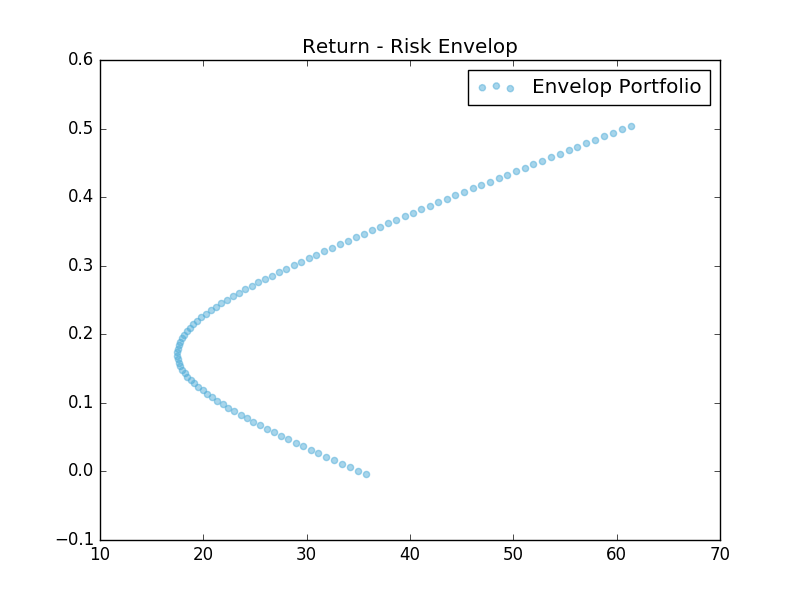

本实例从获取数据开始讲解如何使用Pandas对股票数据进行简单的投资组合分析，画出有效边界。

<!--More-->

## 数据准备

首先我们打开python解释器，引入我们今天所需要的工具,numpy/Matplotlib/Pandas

	```Python
	import numpy as np 
	import matplotlib.pyplot as plt 
	import pandas as pd 
	```
接着我们从Yahoo Finance 上面找到需要的股票数据，我们以亚马逊，Netflix,英伟达，Adobe,Priceline这几家比较熟悉的公司为例，它们的标志是

	```Python
	tickers=['AMZN','NFLX','NVDA','ADBE','PCLN']
	```
我们把它们最近一年的股票价格历史数据下载下来，放在解释器运行的目录里，并给他们按Ticker更改名称（AMZN.csv），然后使用pandas.read_csv方法加载

	```Python
	amzn = pd.read_csv('AMZN.csv')
	nflx = pd.read_csv('NFLX.csv')
	nvda = pd.read_csv('NVDA.csv')
	adbe = pd.read_csv('ADBE.csv')
	pcln = pd.read_csv('PCLN.csv')
	```

由于我们使用pandas进行加载，pandas自身会对数据进行优化操作，所以我们可以看到加载后整齐的输出结果，我们来看下amazon的股价

	```Python
	In [65]: amzn
	Out[65]: 
			   Date        Open        High         Low       Close    Volume   Adj Close
	0    2017-02-24  844.690002  845.809998  837.750000  845.239990   3676400  845.239990
	1    2017-02-23  857.570007  860.859985  848.000000  852.190002   3454600  852.190002
	2    2017-02-22  856.950012  858.429993  852.179993  855.609985   2613400  855.609985
	3    2017-02-21  848.840027  857.979980  847.250000  856.440002   3490100  856.440002
	4    2017-02-17  842.000000  847.270020  840.729980  845.070007   3029800  845.070007
	..          ...         ...         ...         ...         ...       ...         ...
	249  2016-03-01  556.289978  579.250000  556.000000  579.039978   5038500  579.039978
	250  2016-02-29  554.000000  564.809998  552.510010  552.520020   4145400  552.520020
	251  2016-02-26  560.119995  562.500000  553.169983  555.229980   4877000  555.229980
	252  2016-02-25  555.520020  559.390015  545.289978  555.150024   4525500  555.150024
	```

现在我们有了这些数据，但是这些并不都是我们需要的。在这次投资组合分析中，我们需要找到的每日股价涨跌幅：**用当日的收盘价除以前一天的收盘价**，为什么不用开盘价呢？因为有After 和 Pre market交易的存在。所以即使交易所3点后停止交易，很多机构投资者仍然可以通过其他渠道进行交易。由于我们在计算过程中需要使用前一天的收盘价，所以数据上最早的一天的涨幅我们无法计算。下面代码会计算出每家公司股价全年的涨跌幅并将这五个子列表放入同一个列表中

	```Python
	roc =[]
	for each in raw_data:
		roc.append((each['Close'].values/np.roll(each['Close'].values,-1)-1)[:-1][::-1]*100)
	```

第三行看着有点长，但逻辑很简单

1. each['Close'].values是指each(在循环中指代公司)中的'Close'这一列的值，相当于Excel直接选择某一列，我们可以按顺序得到当日的收盘价
2. np.rool(each['Close'].values,-1)表示将这个列表向前推一格，即(1,2,3,4)变成(2,3,4,1).这样我们可以得到上一日的收盘价
3. 将两个数组做一个除法 （1,2,3)/(2,3,1) = (1/2,2/3,3/1)
4. 最后一行的数据由于没有之前的收盘价，所以用[:-1]删掉。我们之前平移数组顶掉的数字也在这一行，一同删掉。
5. 用[::-1]将列表反转，从前往后
6. 由于使用小数，为了便于查看，我们 x 100 变成百分数
7. append方法将这个处理好的数组放在roc的列表中


得到的列表应该是这样的,5个子列表，每个列表252条数据

	```Python
	[[ 0.01440, -0.48808,  4.79982, ..., -0.09691, -0.39971, -0.81555],   
       [ 0.27505, -1.45585,  5.23498, ...,  0.88359, -0.75073,  0.32918], 
       [-0.65851, -1.01010,  4.43239, ..., -0.27910, -9.27230,  0.96527],
       [-0.09230, -1.67436,  3.78156, ..., -0.13374, -0.53570,  0.40394],
       [-0.72344,  0.87222,  2.42727, ...,  0.28780, -0.87665, -0.34448]]
    ```

由于roc是python的列表，仍不具有numpy array的优势，而且要使用pandas,我们需要以行为单位而不是列为单位，所以我们要以日期为基准获得252行
我们要先将roc转化为一个二维的的矩阵（数组），然后对其进行翻转（.T表示Transpose，即获得转置矩阵。）

	```Python		
	roc = np.array(roc).T
	```

下面是转置后的矩阵

	```Python
	In [67]: roc
	Out[67]: 
	array([[ 0.01440,  0.27505, -0.65851, -0.09230, -0.72344],
		   [-0.48808, -1.45585, -1.01010, -1.67436,  0.87222],
		   [ 4.79982,  5.23498,  4.43239,  3.78156,  2.42727],
		   ..., 
		   [-0.09691,  0.88359, -0.27910, -0.13374,  0.28780],
		   [-0.39971, -0.75073, -9.27230, -0.53570, -0.87665],
		   [-0.81555,  0.32918,  0.96527,  0.40394, -0.34448]])
	```

我们现在有252行数据了，需要一个日期来对每一行进行标记方便查看，直接从之前提取的数据中获得。处理方式同涨跌幅类似，去掉最早一天，反转

	```Python
	dates = pd.to_datetime(amzn['Date'][:-1][::-1])
	```

然后我们使用pandas 的dataFrame来创建一个新的数据框架,列名称为ticker，行名称为日期

	```Python
	rocdf = pd.DataFrame(roc,index=dates,columns=tickers)
	#index接受日期列表
	#columns接收ticker列表
	
	                AMZN      NFLX      NVDA      ADBE      PCLN
	Date                                                        
	2016-02-26  0.014403  0.275047 -0.658511 -0.092296 -0.723440
	2016-02-29 -0.488079 -1.455847 -1.010098 -1.674360  0.872216
	2016-03-01  4.799818  5.234984  4.432395  3.781563  2.427272
	...              ...       ...       ...       ...       ...
	2017-02-22 -0.096915  0.883587 -0.279101 -0.133742  0.287795
	2017-02-23 -0.399713 -0.750731 -9.272304 -0.535698 -0.876650
	2017-02-24 -0.815547  0.329178  0.965271  0.403935 -0.344479
	```

	
这样我们前期的数据准备工作都基本做好了,接下来我们来看如何将其运用到投资组合分析上。


## 两个投资方案

在进行分析前，我们先看我们收集的信息，pandas提供describe()来描述数据的基本信息，包含基本的均值，标准差，最大最小值等

	```Python
	In [70]: rocdf.describe()
	Out[70]: 
				 AMZN        NFLX        NVDA        ADBE        PCLN
	count  252.000000  252.000000  252.000000  252.000000  252.000000
	mean     0.177009    0.194823    0.499515    0.134487    0.112379
	std      1.428119    2.451156    2.913356    1.238686    1.460104
	min     -5.137101  -13.126204   -9.272304   -5.726032  -11.369583
	25%     -0.556960   -0.831909   -0.678360   -0.488501   -0.512958
	50%      0.142906    0.003979    0.275135    0.021979    0.124173
	75%      0.867294    1.224020    1.614347    0.724158    0.755365
	max      9.566450   19.028054   29.806706    7.115877    6.606639
	```
我们需要这其中的均值mean

	```Python
	expret = np.array(rocdf.mean())
	```

接着，求出方差／协方差的矩阵。(np.dot为矩阵相乘所使用的函数)。

>**方差／协方差的矩阵(S) = （股价涨跌幅矩阵 － 收益率）（转置）＊（股价涨跌幅矩阵 － 收益率）**

	```Python
	var_covar = np.dot((rocdf.values-expret).T,(rocdf.values-expret))
	```

假设我们现在有两种方案，方案x和y,对五个公司股票的持有率分别是（顺序参见ticker）

	```Python
	port_x = [0.2,0.1,0.15,0.35,0.2]
	port_y = [0.2,0.3,0.25,0.15,0.1]
	```

**现在我们需要一种投资方案，是x和y两种方案的结合，根据x和y所占不同比重来获得风险和收益变化曲线。**

首先我们需要对这两个股票分别进行分析

求出x方案的预期（平均）收益率，该收益率为**各个公司股票收益率与其所占比例的乘积之和**。我们通过矩阵乘法来实现.

	```Python
	x_mean = np.dot(expret,port_x)
	```

求出x方案的方差, 等价于X和自身的协方差Covar(X,X)

>**x方案方差  = x方案权重组合（转置）* 方差／协方差的矩阵(S) * x方案权重组合**

	```Python
	x_var = np.dot(np.dot(port_x.T,var_covar),port_x)
	```

y方案同理。

接着我们求出x,y的协方差Covar(X,Y).可以和刚才求X方差对比一下看看有何异同

>**x,y协方差  = x方案权重组合（转置）* 方差／协方差的矩阵(S) * y方案权重组合**

	#!Python
	xy_covar = np.dot(np.dot(port_x,var_covar),port_y)

还有相关系数

>**相关系数 = x,y协方差/根号下(x方案方差\*)**

	```Python
	xy_corr = xy_covar/np.sqrt(x_var*y_var)
	```
有了这些信息后，我们可以将两个方案按一定比例结合在一起


## 投资组合分析

假设我们x方案占30%，

	```Python
	x_in_comb = 0.3
	```
那么y方案占 1-x_in_comb = 0.7

求出新组合的预期（平均）收益，同样是加权平均

	```Python
	comb_mean = x_mean*x_in_comb+y_mean*(1-x_in_comb)
	```
求出新组合的加权后的方差和标准差(np.sqrt为开平方)

	```Python
	comb_var = x_in_comb**2*x_var+(1-x_in_comb)**2*y_var+2*x_in_comb*(1-x_in_comb)*xy_covar
	comb_stddev = np.sqrt(comb_var)
	```
至此，我们获得新组合的均值和标准差，分别代表了该组合的收益(Return)和风险(Risk).但是这并不能直观地带给我们什么信息，因为我们所得数据只是基于x方案占30%这一假设之上。我们需要根据一系列假设来获得一系列的收益(Return)和风险(Risk)值并进行分析。这时候我们需要使用np.arange来生成－5到＋5之间的数字（负代表做空，大于1代表使用杠杆），间隔为0.1

	```Python
	#np.arange(最小值，最大值(不包括），间隔)
	portfolio=np.arange(-5.0,5.1,0.1)
	```
然后再将刚才我们求新组合的标准差和均值的方法写成函数重复利用

	```Python
	def table_of_returns(x_in_comb):	
		comb_mean = x_mean*x_in_comb+y_mean*(1-x_in_comb)
		comb_var = x_in_comb**2*x_var+(1-x_in_comb)**2*y_var+2*x_in_comb*(1-x_in_comb)*xy_covar
		comb_stddev = np.sqrt(comb_var)
		return comb_stddev,comb_mean
	```	
生成-5到+5之间的各种情况，类似于excel的data table,并使用pandas处理为DataFrame形式

	```Python
	result = np.array([table_of_returns(x) for x in portfolio])
	df = pd.DataFrame(result,index=portfolio,columns=['Risk (stddev)','Return (mean)'])
	```
查看结果

	```Python
	In [75]: df
	Out[75]: 
		  Risk (stddev)  Return (mean)
	-5.0      61.351124       0.504043
	-4.9      60.489123       0.498965
	-4.8      59.628240       0.493887
	-4.7      58.768522       0.488809
	-4.6      57.910022       0.483731
	-4.5      57.052795       0.478653
	...             ...            ...
	 2.1      18.192939       0.143499
	 2.2      18.464156       0.138421
	 2.3      18.774621       0.133342
	 2.4      19.122421       0.128264
	 2.5      19.505559       0.123186
	... 
	```
## 画出Envelop portfolio曲线图

这次仍然使用我们之前的Matplotlib来做图

	```Python
	plt.figure()
	plt.scatter(df['Risk (stddev)'],df['Return (mean)'],alpha = 0.5,color='#51ADD8',label = 'Envelop Portfolio')
	plt.legend(loc='best')
	plt.title('Return - Risk Envelop')
	
>	**>>>plt.show()**
	```
	



图为Envelop Portfolio根据图我们不难看出，

- 即便是在低收益率的情况下，风险反而会增高。
- 同一个风险值可能会对应两个不同的收益率，我们当然会选择高收益的那一点，所以该曲线下半部分是无效的。而上半部分我们称为有效边界（Efficient Frontier),由美国著名经济学家哈里•马科维茨（Harry Markowitz ）提出
- 有效边界为当前组合最优结果，超过该边界即各组合之和大于100%(不可行)，低于该边界可行但是不是最有效的
- 该边界只是当前组合的最优模型，而不是最优组合

那我们有没有更好的组合呢？能不能找到一个在有效边界上的最优点呢？我们下期继续

