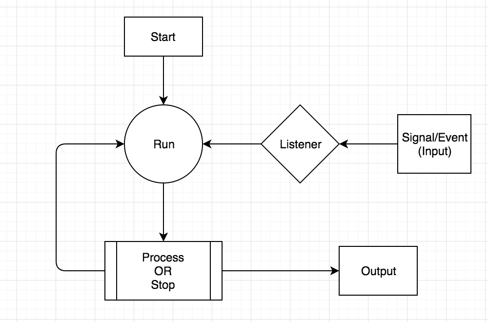

生活中我们经常会用到一些代理服务器，尤其在做爬虫抓取对方网站数据的时候，很容易会被对方服务器封IP。通常我在抓取数据的时候会采用**抓取数据->IP被封时触发代理抓取机制->使用代理继续抓取->代理耗尽重新抓取**的机制，显得有些粗糙，而且在抓取代理的时候会阻塞，非常影响效率。痛定思痛，在开发Jalapeno的时候接触到事件驱动引擎，于是决定开发这个独立持续运转的代理池。

本节我会从事件驱动引擎开始演示并逐步实现抓取、存活验证等功能，最后完成使用Queue多线程多进程的并行及使用控制器通信。

<!--More-->
## 工具准备

这次我们需要的工具有
- Python3.x （必备lol）
- Requests (熟悉urllib可以代替Requests，免去第三方库依赖)

先引入我们需要的工具

    ```Python
    from threading import Thread #线程模块
    import os #系统调用，识别路径
    import pickle #存储
    import requests as req #Requests模块
    import re #正则表达式
    import time #我们用time.sleep()休眠
    #下面两个是队列模块，保护数据读写不混乱，跨进程通信。
    from queue import Empty,Queue
    from multiprocessing import Queue as QP,Process
    #这里是个坑，在Mac下Multiprocessing 的Queue不能使用qsize， queue的Queue不能跨进程通信及pickle
    ```

## 事件驱动引擎

先简单介绍一下事件驱动引擎的机制，事件驱动，顾名思义就是接收事件再处理事件的一个过程。流程如下

    启动 -> 引擎持续运转待命 ->接收各类事件／信号（包括停止运行）->处理事件,如图
    

    
    
代码结构如下：

    ```Python
    class IP_proxy_pool(object):

        def __init__(self):
            pass
        def Start(self):
            pass
        def __Run(self):
            pass
        def __EventProcess(self,event,eventName):
            pass
        def __Stop(self):
            pass
    ```

接下来我们来看各个部分的代码及其原理
            
### \_\_init__

\__init__包含了我们整个代理池的初始参数，其中一部分是引擎所需要的，另一部分是其他功能的参数。

代码：

    ```Python
    def __init__(self,ready=5,max_pages= 10):
        self.settings = dict(
			Pool_ready = 5,
			max_pages = 10
			)

		self.commander = None
		self.output = None
		self.__workers = {}
		self._Raw = Queue()
		self._available = Queue()
		self.__active = False
		self.__worker_is_working = False
		self.__ready = False
		self._cache_path = os.getcwd()+os.sep+"proxylist.pkl"
		self.header = {'User-Agent':'Mozilla/5.0 (Windows; U; Windows NT 6.1; en-US; rv:1.9.1.6) Gecko/20091201 Firefox/3.5.6'}
		self.command = dict(
			Stop = self.__Stop,
			Crawl = self.crawler,
			Status = self.Status,
			Get= self.get_a_proxy,
			Monitor = self.__Monitor,
			Verify = self.verify_IP) 
    ```
    

- self.setting:代理池默认设置。包含了爬虫最大访问页数和最低可用ip数量        
- self.commander: 引擎组件。作为接收主进程命令的管道，在Start中初始化，并不需要在__init__中出现所以初始为None。后面会在多进程启动部分中讲解
- self.output: 同上，将运行结果反馈给主进程
- self.workers:引擎组件。包含了所有正在工作的子线程，通过dict的形式将任务名称和对应线程联系
- self._Raw：从IP代理网站上解析出来的所有IP地址，未经过验证是否存活
- self._available：存活可用的IP
- self.__active: 引擎组件。当self.__active为True时，引擎保持运转。
- self.__worker_is_working: 当值为True时，表示爬虫正在抓取IP地址。
- self.ready: 监测控件。监测当前代理池中可用IP是否超过最低标准。如果低于标准，将启动IP抓取工作
- self._cache_path: 存储／读取抓取结果到本地的路径
- self.header: 爬虫请求网页的报头，与网络访问相关。会出现在Crawler和Verify中。
- self.command: 包含了输入请求信号所对应的任务

然后就开始我们的引擎组建工作

### Start()

Start()相当于引擎的启动装置，建立通信管道，设置操作模式，最后进入运行。在多进程模式下，由于这是我们启动引擎执行的函数，所以我们使用“args= xxx"将通信和设置变量传入本函数中。

代码：

    ```Python
	def Start(self,commander,output,Manual=True):
		self.__active = True
		self.commander,self.output = commander,output 
		self.read_cache()
		#for each in ['Monitor']
		if Manual:
			self.__Run()
		else:
			for each in ['Crawl','Monitor','Verify']:
				self.commander.put(each)
			self.__Run()
    ```

在Start中：

1.首先我们设置self.__active=True,表示引擎开始运转。

2.构建通信管道 self.commander,self.output，这两个变量是由主进程的控制器传入。

3.读取存档。没有存档会自行创建。

4.如果设置模式为Manual,则只维持运转，需要指令输入。如果不是，则自动启动爬虫，监测系统和IP筛选工作。


### __Run()

__Run()是引擎的运转核心，作用机制比较简单。当active指示为True时，维持运转，持续接收指示信号并交付处理。

   ```Python
    def __Run(self):
		while self.__active:
			try:
				eventname = self.commander.get(block=True,timeout=1)
				self.__EventProcess(self.command[eventname],eventname)
			except Empty:
				pass
    ```
                
先尝试从commander获取指示信号，如果为空，则except捕获异常跳过本轮循环。
如果顺利接受信号，则交付__EventProcess处理。

>注意：commander.get()方法中,我们设置timeout=1避免卡死，设置block来阻塞一个timeout的等待时常，避免程序高速运转浪费过多CPU资源。

### __EventProcess()

__EventProcess()是引擎的事件处理调度模块，它在目前的工作中将任务分成两类并执行：直接执行和开启新线程并行。

    ```Python
	def __EventProcess(self,event,eventName):
		print("Event is Processing")
		#在主程序中直接运行
		if eventName in ('Status','Stop','Get'):
			event()
		else:#开线程运行
			self.__workers[eventName]=Thread(target=event)
			self.__workers[eventName].start()
    ```
		
### __Stop()

Stop()是在当我们的任务完成后，我们将要关闭引擎并自动存档的模块。

    ```Python
	def __Stop(self):
		self.__active = False
		for name,worker in self.__workers.items():		
			worker.join()
		print('\nSaving your proxies . . .')
		self.write_cache()
    ```


整个流程分成三步：

1.关闭active指示

2.等待workers中的所有子线程任务结束。

3.write_cache存档，方便下次读取

>这里需要注意的是关闭active指示需要在第一步。**因为Thread不像Process那样可以调用terminate()强制中止**，所以在相关子线程任务中我们保持了和引擎同步的方法，在任务执行完毕之前**或者self.active=True**的时候，都会保持运行。也就是说如果我们关掉active指示，我们就可以让所有子线程跳出循环自动退出。最后在第二步中用join方法等待任务结束。

到这里我们的完整的食物驱动引擎架构基本完成，我们继续来构建功能性组件。


## 功能性组件

功能性组件实现了我们代理池的核心功能，即抓取IP地址，实时监测，状态输出及读写功能。


### Status()状态输出

状态输出是将我们的代理池的信息以字符串的形式放入output（输出管道），方便我们查看当前运行状态

代码：
    
    ```Python
	def Status(self):
		msg ='''

		Engine Active               {}
		IP Pool Ready               {}
		Crawler Working             {}
		Raw IP Pool size            {}
		Alive IP available          {}

		'''.format(self.__active,self.__ready,self.__worker_is_working,self._Raw.qsize(),self._available.qsize())
		self.output.put(msg)
    ```


示例：

    In [34]: print(remote.send('Status'))
    
    
		Engine Active               True
		IP Pool Ready               False
		Crawler Working             False
		Raw IP Pool size            399
		Alive IP available          0


### crawler():IP抓取爬虫
看到这里终于看到我们的核心组件之一爬虫的真身了。这里我用西刺代理的高匿IP地址页面举例。

    ```Python
	def crawler(self):
		self.__worker_is_working = True
		regex = re.compile(r'<tr class.*?<td.*?<td>(.+?)</td.*?<td>(.+?)</td.*?</td.*?</td.*?<td>(.+?)</td.*?</tr>',re.S)
		for i in range(1,self.settings['max_pages']+1):
			if not self.__active:
				break
			page_source= req.get("http://www.xicidaili.com/nn/{}".format(i),headers =self.header).text
			result = re.findall(regex,page_source)
			for each in result:
				self._Raw.put(each)
			time.sleep(60)
		self.__worker_is_working = False
    ```
1.当爬虫开始运行时设置__worker_is_working = True，表示爬虫结束运行。

2.接下来就是爬虫的抓取流程并将结果放入self.\_Raw中，爬虫可以参考我之前的相关文章。在这里要注意三点：

- 使用requests(req)添加header的方法
- time.sleep(60)设置爬取间隔，减少对方服务器访问压力。此时也可以和IP验证的时间同步
- self.\_Raw使用的结构是队列（QUEUE）的形式，我们在这里用的是线程的Queue()而不是multiprocessing的Queue(),因为线程的Queue()自带线程锁，可以保护数据不错乱。并且可以使用qsize功能来获取队列长度（数量）
    
3.抓取完成。\__worker_is_working = False，退出。


### \__Monitor()

Monitor()的运行机制如下，

    ```Python
    def __Monitor(self):
    	while self.__active:
    		if self.__worker_is_working:
    			pass
    		elif self._available.qsize() < self.settings['Pool_ready']:
    			self.commander.put("Crawl")
    		time.sleep(15)
    ```


- 当引擎运行时，检测爬虫是否在工作。
- 如果没有在工作，检测代理池中的IP是否达到最低标准。
- 如果没有达到，启动爬虫，
- 休息15秒重新检测。

### verify_IP():IP存活验证
 
事实上，并不是每一个从代理网站上抓取到的IP地址**并不一定能用**.所以在这里我们添加一下验证。原理很简单：从self.\_Raw里面拿出一个IP，挂上IP之后去访问一个网站（我这里就用百度了，不要怪我。。lol）,如果访问请求返回结果是200，则说明访问成功，该IP地址可以使用。

代码：

    ```Python
    def verify_IP(self):
        while self.__active:
            try:
                proxy_item = self._Raw.get(block=True,timeout=1)
                #注意下面使用IP的格式 {'HTTPS'：'183.159.80.92:18118'}
                req_proxy = {proxy_item[2]:'{}:{}'.format(proxy_item[0],proxy_item[1])}
                print("verifying {}:{}".format(proxy_item[0],proxy_item[1]))
                attempt = req.get('http://www.baidu.com',headers= self.header,proxies = req_proxy,timeout=5)#注意这里使用IP的方式
                if attempt.status_code == 200:
                    self._available.put(attempt)
            except Empty:
                print("Raw pool is empty")
                time.sleep(60)
            except:
                pass
    ```


###get_a_proxy() 获得一个IP地址（输出）        

这一块的任务相对来说就简单许多，你只需要从可用的IP队列中获得一个并输出即可。（当可用IP队列为空时我用原始_Raw列队列充数这种事情我是不会说出来的hiahiahia，当然如果愿意用自己的爬虫来验证是否可用而不去检测有效的时候，会有一定的灵活操作空间）
    
    ```Python
	def get_a_proxy(self):
		try:

			if self._available.qsize() > 0:
				ip = self._available.get(block=True,timeout=1)
			else:
				ip = self._Raw.get(block=True,timeout=1)
			self.output.put(ip)

		except:
			self.output.put('Oops. Both pools Empty.')   
    ```    


### 存档读写

抓取了很多很多好用的代理不想白白浪费吧，下次要用的时候不想等重头来过吧。存档读写功能，你值得拥有。
        
    ```Python   
	def read_cache(self):
        #检测是否文件已存在。如果没有就创建一个
		if not os.path.isfile(self._cache_path):
			self.write_cache()
        #读取内容
		else:
			try:
				f = open(self._cache_path,'rb')
				raw,available = pickle.load(f)
				[self._Raw.put(each) for each in raw]
				[self._available.put(each) for each in available]
				f.close()
			except:
				pass
    #存档            
	def write_cache(self):
		f = open(self._cache_path,"wb")
		raw = list(self._Raw.queue)
		available = list(self._available.queue)
		pickle.dump([raw,available],f)
		f.close()        
    ```
比较令人郁闷的是我们的线程Queue()不能直接pickle存储，所以我们在这里先将其转换成列表.

好了，我们的IP代理池到这里就完结了？
NoNoNo,我们需要一个控制器来操作它。

## 使用方法

我们来看一下我们在主进程是如何调用它的


### Controller()：控制器

前面讲到我们需要进行进程间的通信，所以我们使用self.commander和self.output来作为通信管道。我们将这两个管道和操作方法一起封装在一起，就是我们的控制器。

    ```Python  
    class Controller():
        def __init__(self):
            self.commander = QP()
            self.output = QP()

        def send(self,command):
            self.commander.put(command)
            if command in ['Status','Get']:
                return self.output.get(timeout=1)          
    ```

需要注意的是我们必须使用multiprocessing 封装的Queue才可以进行通信，

### 操作

一个简单的操作演示，在解释器上跑跑看

    ```Python
    #先创建一个代理池
    In [39]: pool = IP_proxy_pool()
    #创建控制器
    In [40]: remote = Controller()
    #创建一个新进程来使用代理池引擎
    In [41]: pool_process= Process(target = test.Start,args = (remote.commander,remote.output,))
    #启动引擎,这里的start不是引擎的Start，是进程的启动操作，通过start()调用Start()
    In [42]:pool_process.start()
    #最后可以通过Controller的send()方法操作
    In [43]: remote.send('Get')
    Out[43]: ('49.81.34.87', '46491', 'HTTPS')
    ```
    
好啦，一个IP代理池到这里就被我们构建出来了。可以放在代码里自动运行也可以在解释器里面手工操作获得IP地址。以后挂代理看视频抓数据就用它了hiahiahia.

哦对了，最后留几个作业lol:想想看如何完善里面的监测和报错机制，如何抓取其他网站的IP，如何避免抓取到重复的IP

先就这么多了，Bye~
    
## 完整代码

    ```Python
    from threading import Thread
    import os
    import pickle
    import requests as req
    import re
    import time
    from queue import Empty,Queue
    from multiprocessing import Queue as QP,Process
    #这里是个坑，Multiprocessing 的Queue不能使用qsize， queue的Queue不能跨进程通信及pickle


    class IP_proxy_pool(object):

        def __init__(self,ready=5,max_pages= 10):
            self.settings = dict(
                Pool_ready = 5,
                max_pages = 10
                )

            self.commander = None
            self.output = None
            self.__workers = {}
            self._Raw = Queue()
            self._available = Queue()
            self.__active = False
            self.__worker_is_working = False
            self.__ready = False
            self._cache_path = os.getcwd()+os.sep+"proxylist.pkl"
            self.header = {'User-Agent':'Mozilla/5.0 (Windows; U; Windows NT 6.1; en-US; rv:1.9.1.6) Gecko/20091201 Firefox/3.5.6'}
            self.command = dict(
                Stop = self.__Stop,
                Crawl = self.crawler,
                Status = self.Status,
                Get= self.get_a_proxy,
                Monitor = self.__Monitor,
                Verify = self.verify_IP)

        def Start(self,commander,output,Manual=True):
            self.__active = True
            self.commander,self.output = commander,output 
            self.read_cache()
            #for each in ['Monitor']
            if Manual:
                self.__Run()
            else:
                for each in ['Crawl','Monitor','Verify']:
                    self.commander.put(each)
                self.__Run()

        def __Run(self):

            while self.__active:
                try:
                    eventname = self.commander.get(block=True,timeout=1)
                    #Need Check event
                    print("Receive the command {}".format(eventname))
                    self.__EventProcess(self.command[eventname],eventname)
                except Empty:
                    pass

        def __EventProcess(self,event,eventName):
            print("Event is Processing")
            #在主程序中直接运行
            if eventName in ('Status','Stop','Get'):
                event()
            else:#开线程运行
                self.__workers[eventName]=Thread(target=event)
                self.__workers[eventName].start()


        def __Stop(self):
            self.__active = False
            for name,worker in self.__workers.items():		
                worker.join()
            print('\nSaving your proxies . . .')
            self.write_cache()

        def Status(self):
            print("You reached level Status")
            msg ='''

            Engine Active               {}
            IP Pool Ready               {}
            Crawler Working             {}
            Raw IP Pool size            {}
            Alive IP available          {}

            '''.format(self.__active,self.__ready,self.__worker_is_working,self._Raw.qsize(),self._available.qsize())
            self.output.put(msg)

        def crawler(self):
            self.__worker_is_working = True
            regex = re.compile(r'<tr class.*?<td.*?<td>(.+?)</td.*?<td>(.+?)</td.*?</td.*?</td.*?<td>(.+?)</td.*?</tr>',re.S)
            for i in range(1,self.settings['max_pages']+1):
                if not self.__active:
                    break
                page_source= req.get("http://www.xicidaili.com/nn/{}".format(i),headers =self.header).text
                result = re.findall(regex,page_source)
                for each in result:
                    self._Raw.put(each)
                time.sleep(60)
            self.__worker_is_working = False

        def __Monitor(self):
            while self.__active:
                if self.__worker_is_working:
                    pass
                elif self._available.qsize() < self.settings['Pool_ready']:
                    self.commander.put("Crawl")
                time.sleep(15)


        def verify_IP(self):
            while self.__active:
                try:
                    proxy_item = self._Raw.get(block=True,timeout=1)
                    req_proxy = {proxy_item[2]:'{}:{}'.format(proxy_item[0],proxy_item[1])}
                    print("verifying {}:{}".format(proxy_item[0],proxy_item[1]))
                    attempt = req.get('http://www.baidu.com',headers= self.header,proxies = req_proxy,timeout=5)
                    if attempt.status_code == 200:
                        self._available.put(attempt)
                except Empty:
                    print("Raw pool is empty")
                    time.sleep(60)
                except:
                    pass

        def get_a_proxy(self):
            try:

                if self._available.qsize() > 0:
                    ip = self._available.get(block=True,timeout=1)
                else:
                    ip = self._Raw.get(block=True,timeout=1)
                self.output.put(ip)

            except:
                self.output.put('Oops. Both pools Empty.')


        def read_cache(self):
            if not os.path.isfile(self._cache_path):
                self.write_cache()
            else:
                try:
                    f = open(self._cache_path,'rb')
                    raw,available = pickle.load(f)
                    [self._Raw.put(each) for each in raw]
                    [self._available.put(each) for each in available]
                    f.close()
                except:
                    pass

        def write_cache(self):
            f = open(self._cache_path,"wb")
            raw = list(self._Raw.queue)
            available = list(self._available.queue)
            pickle.dump([raw,available],f)
            f.close()

    class Controller():
        def __init__(self):
            self.commander = QP()
            self.output = QP()

        def send(self,command):
            self.commander.put(command)
            if command in ['Status','Get']:
                return self.output.get(timeout=1)
    ```

## Reference
- [事件驱动引擎原理和使用: vn.py](http://www.vnpy.org/basic-tutorial-4.html)
- [Python爬虫代理池结构](http://python.jobbole.com/86994/)
- [ChenghaoQian.com: （我自己）](http://chenghaoqian.com)


  